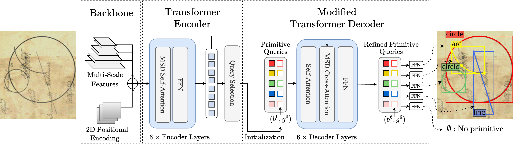

# Historical Diagram Vectorization

This repo is the official implementation for [Historical Astronomical Diagrams
Decomposition in Geometric Primitives](http://imagine.enpc.fr/~kallelis/icdar2024/). 


This repo builds on the code for [DINO-DETR](https://github.com/IDEA-Research/DINO), the official implementation of the paper "[DINO: DETR with Improved DeNoising Anchor Boxes for End-to-End Object Detection](https://arxiv.org/abs/2203.03605)". 


# Introduction
We present a model which modifies DINO-DETR to perform historical astronomical diagram vectorization by predicting simple geometric primitives, such as lines, circles, and arcs. 



# Getting Started
<details>
  <summary>1. Installation</summary>
  The model was trained with ```python=3.11.0 pytorch=2.1.0,cuda=11.8``` and builds on the DETR-variants DINO/DN/DAB and Deformable-DETR. 

  1. Clone this repository.
  2. Install Pytorch and Torchvision. The model builds on the DETR-variants DINO/DN/DAB and Deformable-DETR. If you have the environment for DINO/DN/DAB DETR, you can skip this part.
    Follow the instruction on https://pytorch.org/get-started/locally/ 
```sh
pip install torch torchvision --index-url https://download.pytorch.org/whl/cu118
```
    
  3. Install other needed packages
```sh
pip install -r requirements.txt
```
  4. Compiling CUDA operators
```sh
cd src/models/dino/ops
python setup.py build install
# unit test (should see all checking is True) # could output an outofmemory error
python test.py
cd ../../../..
```
   5. Installing the local package for synthetic data generation
```sh
cd synthetic 
pip install -e .
cd ../
```
</details>


<details><summary>2. Annotated Dataset and Model Checkpoint </summary>

Our annotated dataset along with our main model checkpoints can be found [here](https://drive.google.com/drive/folders/1W3SdaGah2l8QIxPcQt4i3s446NAzPx4J?usp=sharing). Annotations are in SVG format. We provide helper functions for parsing svg files in Python if you would like to process a custom annotated dataset. 
Once downloaded and organized as follows:
```sh
data/
  └── eida_dataset/
  	 └── images_and_svgs/
  └── custom_dataset/
  	 └── images_and_svgs/
```
You can process the ground-truth data for evaluation using: 
```sh
bash scripts/process_annotated_data.sh
```
</details>
<details>
<summary>3. Synthetic Dataset </summary>

The synthetic dataset generation process requires a resource of text and document backgrounds. We use the resources in [docExtractor](https://github.com/monniert/docExtractor) and in [diagram-extraction](https://github.com/Segolene-Albouy/Diagram-extraction).
This resource is part of the dataset used in docExtractor and in diagram-extraction. The code for generating the synthetic data is also heavily based on docExtractor.

To get the synthetic resource (backgrounds) for the synthetic dataset you can launch: 

```sh
bash scripts/download_synthetic_resource.sh
```
<details><summary>Or download and unzip the data</summary>

Download the synthetic resource folder [here](https://www.dropbox.com/s/tiqqb166f5ygzx2/synthetic_resource.zip?dl=0) and unzip it in the data folder. 

</details>
</details>


# Evaluation and Testing

<details>
  <summary>1. Evaluate our pretrained models</summary>

  After downloading and processing the evaluation dataset, you can evaluate the pretrained model as follows. 
  Download a model checkpoint, for example "checkpoint0012.pth" and launch

```sh
bash scripts/evaluate_on_eida_final.sh model_name epoch_number
```

  For example:

```sh
bash scripts/evaluate_on_eida_final.sh main_model 0012
```
You should get the AP for different primitives and for different distance thresholds. 
</details>


<details>

  <summary>2. Inference and Visualization</summary>

For inference and visualizing results over custom images, you can use the [notebook](src/inference.ipynb).

</details>

# Training
<details>
  <summary>1. Training from scratch on synthetic data</summary>
To re-train the model from scratch on the synthetic dataset, you can launch 

```sh
bash scripts/train_model.sh config/
```
</details>
<details>
  <summary>2. Training on a custom dataset</summary>
To train on a custom dataset, the custom dataset annotations should be in a COCO-like format, and should be in 

```sh
  data/
    └── custom_dataset_processed/
      └── annotations/
      └── train/
      └── val/
```
You should then adjust the coco_path variable to 'custom_dataset_processed' in the [config](src/config/DINO_4scale.py) file.
</details>


</details>


<!-- 

# Bibtex
If you find this work useful, please consider citing:

```bibtex

``` -->
