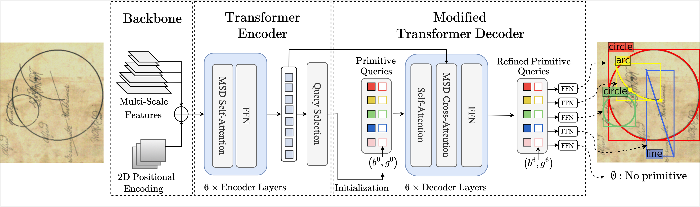

# Historical Diagram Vectorization

This repo is the official implementation for [Historical Astronomical Diagrams Decomposition in Geometric Primitives](http://imagine.enpc.fr/~kallelis/icdar2024/).

This repo builds on the code for [DINO-DETR](https://github.com/IDEA-Research/DINO), the official implementation of the paper "[DINO: DETR with Improved DeNoising Anchor Boxes for End-to-End Object Detection](https://arxiv.org/abs/2203.03605)".

# Introduction
We present a model which modifies DINO-DETR to perform historical astronomical diagram vectorization by predicting simple geometric primitives, such as lines, circles, and arcs.



# Getting Started
<details>
  <summary>1. Installation</summary>

The model was trained with `python=3.11.0`, `pytorch=2.1.0`, `cuda=11.8` and 
builds on the DETR-variants [DINO](https://arxiv.org/abs/2203.03605)/[DN](https://arxiv.org/abs/2203.01305)/[DAB](https://arxiv.org/abs/2201.12329) and [Deformable-DETR](https://arxiv.org/abs/2010.04159). 

1. Clone this repository and create virtual environment
   ```bash
   git clone git@github.com:vayvi/HDV.git
   cd HDV/
   python3 -m venv venv
   source venv/bin/activate
   ```
2. Follow instructions to install a [Pytorch](https://pytorch.org/get-started/locally/) version compatible with your system and CUDA version
3. Install other dependencies
    ```bash
    pip install -r requirements.txt
    ```
4. Compiling CUDA operators
    ```bash
    python src/models/dino/ops/setup.py build install # 'cuda not availabel', run => export CUDA_HOME=/usr/local/cuda-<version>
    # unit test (should see all checking is True) # could output an outofmemory error
    python src/models/dino/ops/test.py
    ```
5. Installing the local package for synthetic data generation
    ```bash
    pip install -e synthetic/.
    ```
</details>

<details>
    <summary>2. Annotated Dataset and Model Checkpoint</summary>

Our annotated dataset along with our main model checkpoints can be found [here](https://drive.google.com/drive/folders/1W3SdaGah2l8QIxPcQt4i3s446NAzPx4J?usp=sharing). 
Annotations are in SVG format. We provide helper functions for parsing svg files in Python if you would like to process a custom annotated dataset.

To download the manually annotated dataset, run:
```bash
bash scripts/download_eida_data.sh
```

Datasets should be organized as follows:
```bash
HDV/
  data/
    └── eida_dataset/
      └── images_and_svgs/
    └── custom_dataset/
      └── images_and_svgs/
```

To download the pretrained models, run:
```bash
bash scripts/download_pretrained_models.sh
```

Checkpoints should be organized as follows:
```bash
HDV/
  logs/
    └── main_model/
      └── checkpoint0012.pth
      └── checkpoint0036.pth
      └── config_cfg.py
    └── other_model/
      └── checkpoint0044.pth
      └── config_cfg.py
    ...
```

You can process the ground-truth data for evaluation using:
```bash
bash scripts/process_annotated_data.sh "eida_dataset" # or "custom_dataset", etc.
```
</details>

<details>
<summary>3. Synthetic Dataset</summary>

### Generate Synthetic Dataset

The synthetic dataset generation process requires a resource of text and document backgrounds. 
We use the resources available in [docExtractor](https://github.com/monniert/docExtractor) and [diagram-extraction](https://github.com/Segolene-Albouy/Diagram-extraction).
The code for generating the synthetic data is also heavily based on docExtractor.

To get the synthetic resource (backgrounds) for the synthetic dataset you can launch:
```bash
bash scripts/download_synthetic_resource.sh
```

### Or download it

Download the synthetic resource folder [here](https://www.dropbox.com/s/tiqqb166f5ygzx2/synthetic_resource.zip?dl=0) and unzip it in the data folder.

</details>

# Evaluation and Testing

<details>
  <summary>1. Evaluate our pretrained models</summary>

After downloading and processing the evaluation dataset, you can evaluate the pretrained model as follows.
Download a model checkpoint: 
- `model_name` corresponds to the folder inside `logs/` where the checkpoint file is located
- `epoch_number` epoch number of the checkpoint file to be used
- `data_folder_name` is the name of the folder inside `data/` where the evaluation dataset is located (default to `eida_dataset`)

```bash
bash scripts/evaluate_on_eida_final.sh <model_name> <epoch_number> <data_folder_name>
```

For example:
```bash
# for logs/main_model/checkpoint0036.pth on eida_dataset
bash scripts/evaluate_on_eida_final.sh main_model 0036 eida_dataset

# for logs/eida_demo_model/checkpoint0044.pth on eida_dataset
bash scripts/evaluate_on_eida_final.sh eida_demo_model 0044
```

You should get the AP for different primitives and for different distance thresholds.
</details>

<details>

  <summary>2. Inference and Visualization</summary>

For inference and visualizing results over custom images, you can use this [notebook](src/notebooks/inference.ipynb).

You can also use the following script to run inference on a whole dataset (jpg images located in `data/<data_folder_name>/images/`):
```bash
bash scripts/run_inference.sh <model_name> <epoch_number> <data_folder_name> <export_formats>

# for logs/main_model/checkpoint0036.pth on eida_dataset with svg and npz export formats
bash scripts/run_inference.sh main_model 0036 eida_dataset svg+npz
```

Results will be saved in `data/<data_folder_name>/<export_format>_preds_<model_name><epoch_number>/`.

</details>

# Training
<details>
  <summary>1. Training from scratch on synthetic data</summary>

To re-train the model from scratch on the synthetic dataset (created on the fly), you can launch 

```bash
bash scripts/train_model.sh
```
</details>

<details>
  <summary>2. Training on a custom dataset</summary>

Turn SVG files into COCO-like annotations using the following script:
- `data_set` folder inside `data/` where the evaluation dataset is located (default to `eida_dataset`)
- `sanity_check` add it whether you want to visualize the processed annotations (will save the images in `data/<data_set>/svgs/`)
- `train_portion` float value in between 0 and 1 to split the dataset into train and val (default to `0.8`)

```bash
  data/
    └── <dataset_name>/
      └── images/     # folder containing annotated images in the svgs folder
      └── svgs/       # folder containing SVG files containing ground truth for training
```

```bash
python src/svg_to_train.py --data_set <dataset_name> --sanity_check

# for eida_dataset
python src/svg_to_train.py --data_set eida_dataset --sanity_check
```

Training data will be created in `data/<dataset_name>/groundtruth/`. You can use it to run the finetuning script.
To train on a custom dataset, the ground truth annotations should be in a COCO-like format, thus be structured as follows: 

```bash
  data/
    └── <groundtruth_data>/
      └── annotations/     # folder containing JSON files (one for train, one for val) in COCO-like format
      └── train/           # train images (corresponding to train.json)
      └── val/             # val images (corresponding to val.json)
```

Run the following script to train the model on the custom dataset:
- `model_name` corresponds to the folder inside `logs/` where the checkpoint file is located (will take the last checkpoint)
- `groundtruth_dir` relative path to a folder inside `data/` where the ground truth dataset is located
- `device_nb` GPU device number to use for training (default to `0`)
- `batch_size` batch size for training (default to `2`)

```bash
bash scripts/finetune_model.sh <model_dirname> <groundtruth_dir> <device_nb> <device_nb>

# to use the data generated by the previous script
bash scripts/finetune_model.sh main_model eida_dataset/groundtruth 2 2
```
</details>

# Bibtex

If you find this work useful, please consider citing:

```
@misc{kalleli2024historical,
    title={Historical Astronomical Diagrams Decomposition in Geometric Primitives},
    author={Syrine Kalleli and Scott Trigg and Ségolène Albouy and Matthieu Husson and Mathieu Aubry},
    year={2024},
    eprint={2403.08721},
    archivePrefix={arXiv},
    primaryClass={cs.CV}
}
```
